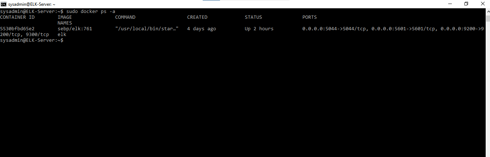

# elk-project
## Automated ELK Stack Deployment
The files in this repository were used to configure the network depicted below.

These files have been tested and used to generate a live ELK deployment on Azure. They can be used to either recreate the entire deployment pictured above. Alternatively, select portions of the YAML file may be used to install only certain pieces of it, such as Filebeat.
  - _TODO: Enter the playbook file._
![Elk YAML file] (ansible/elk-config.yml)
This document contains the following details:
- Description of the Topologu
- Access Policies
- ELK Configuration
  - Beats in Use
  - Machines Being Monitored
- How to Use the Ansible Build
### Description of the Topology
The main purpose of this network is to expose a load-balanced and monitored instance of DVWA, the D*mn Vulnerable Web Application.
Load balancing ensures that the application will be highly available, in addition to restricting access to the network.
- _TODO: What aspect of security do load balancers protect? What is the advantage of a jump box?_
Load balancers protect the availability of network. They also protect a network from DDOS attacks by distributing loads to the servers.
The advantage of a jump box is that you can have secure access to manage your servers as it is an origination point to connect to the other servers in that network.
Integrating an ELK server allows users to easily monitor the vulnerable VMs for changes to the __logs_ and system _analysis_.
- _TODO: What does Filebeat watch for?_
Filebeat monitors and collects log files, and forwards them to Elasticsearch. 
- _TODO: What does Metricbeat record?_
Metricbeat takes the metrics and statistics of a system and forwards it to Elasticsearch.
The configuration details of each machine may be found below.
_Note: Use the [Markdown Table Generator](http://www.tablesgenerator.com/markdown_tables) to add/remove values from the table_.

| Name     | Function | IP Address | Operating System |
|----------|----------|------------|------------------|
| Jump Box | Gateway  | 10.0.0.4   | Linux            |
| Web 1    | webserver| 10.0.0.5   | Linux            |
| Web 2    | webserver| 10.0.0.6   | Linux            |
| Elk serv | elkserver| 10.1.0.4   | Linux            |
### Access Policies
The machines on the internal network are not exposed to the public Internet. 
Only the ELK machine can accept connections from the Internet. Access to this machine is only allowed from the following IP addresses:
- _TODO: Add whitelisted IP addresses_
Home IP address

Machines within the network can only be accessed by jumpbox VM.
- _TODO: Which machine did you allow to access your ELK VM? What was its IP address?_
Jump Box 104.210.77.170

A summary of the access policies in place can be found in the table below.
| Name     | Publicly Accessible | Allowed IP Addresses |
|----------|---------------------|----------------------|
| Jump Box |     yes             | Home IP              |
| web1/web2|     No              | 104.210.77.170       |
|  elk     |     No              | 104.210.77.170       |

### Elk Configuration
Ansible was used to automate configuration of the ELK machine. No configuration was performed manually, which is advantageous because...
- _TODO: What is the main advantage of automating configuration with Ansible?_
It allows the user to automate tasks rather than having to spend time doing them manually one at a time.
The playbook implements the following tasks:
- Install docker.io, docker and python-pip3.
- use maximum amount of memory
- download and launch the docker container using image sebp/elk:761 and allow ports 5601 (kibana), 5044 (logstash), 9200 (elasticsearch) to be open 
- enable systemd service so it starts up on reboot.
The following screenshot displays the result of running `docker ps` after successfully configuring the ELK instance.

### Target Machines & Beats
This ELK server is configured to monitor the following machines:
Web 1 10.0.0.5
Web 2 10.0.0.6
We have installed the following Beats on these machines:
I installed FileBeat onto my Web 1 and Web 2 VM's
These Beats allow us to collect the following information from each machine:
Beats are a lightweight shippers for collecting logs or metrics. File beat specifically is installed on the Web Vm's to collect and send log files to the ELK server for analysis.

### Using the Playbook
In order to use the playbook, you will need to have an Ansible control node already configured. Assuming you have such a control node provisioned: 
SSH into the control node and follow the steps below:
- Copy the YAML file to ansible container and into /etc/ansible folder.
- Update the hosts file to include the elk server 10.1.0.4
- Run the playbook, and navigate to the container to check that the installation worked as expected.

- _Which file is the playbook? Where do you copy it?
The playbook is the YAML (.yml) file and it’s to be copied into the ansible folder, inside the ansible folder you could have it into a sub-folder where you store all your playbooks.
- _Which file do you update to make Ansible run the playbook on a specific machine? How do I specify which machine to install the ELK server on versus which to install Filebeat on?_
Update the hosts file, when running a playbook, the third line (hosts) specifies which machines you want to install the elk server or File beat etc.
In this case after editing the hosts file to include elk, your hosts in the playbook would be elk. When installing Filebeat you would specify webservers as the hosts, the webservers are being monitors and the logs are being sent to the elk server. The elk server is specified in the filebeat configuration file which is also listed in the filebeat playbook under drop in filebeat.yml.

- _Which URL do you navigate to in order to check that the ELK server is running?
http://52.163.214.232:5601/app/kibana

_As a **Bonus**, provide the specific commands the user will need to run to download the playbook, update the files etc.
The playbook is provided below, you can use this and run: ansible-playbook filebeat-install.yml
This can be done manually, but is easily executed through a yml file.
This file will download filebeat, install, create a filebeat file, enable system, setup filebeat and start filebeat service, and start up on reboot. You can alter this playbook to user an image with a newer version, you will have to update the package download and the install points of the yml file.

---
- name: installing and launching filebeat
  hosts: webservers
  become: yes
  tasks:

  - name: download filebeat deb
    command: curl -L -O https://artifacts.elastic.co/downloads/beats/filebeat/filebeat-7.6.1-amd64.deb

  - name: install filebeat deb
    command: dpkg -i filebeat-7.6.1-amd64.deb

  - name: drop in filebeat.yml
    copy:
      src: /etc/ansible/files/filebeat-config.yml
      dest: /etc/filebeat/filebeat.yml

  - name: enable and configure system module
    command: filebeat modules enable system

  - name: setup filebeat
    command: filebeat setup

  - name: start filebeat service
    command: service filebeat start

  - name: enable firebeat service
    systemd:
      name: filebeat
      enabled: yes

 
